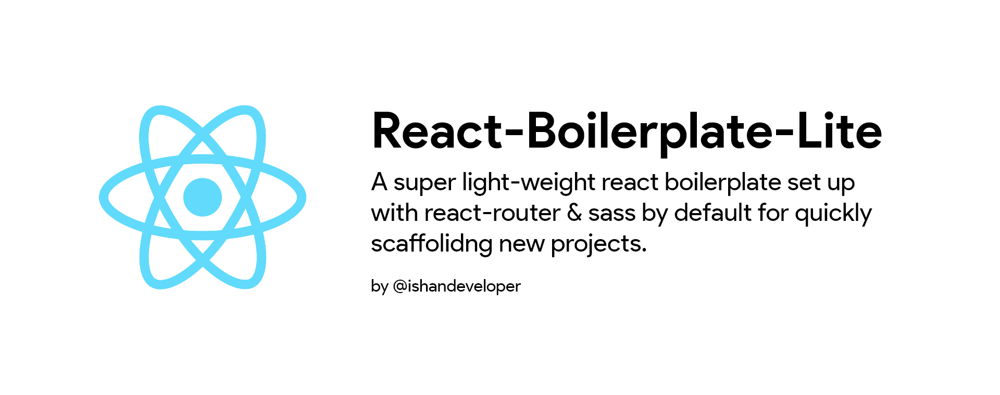

# React-Boilerplate-Lite

A super light-weight react boilerplate with react-router & sass, for helping me to quickly scaffold new projects.

#### View Live Demo
  <pre><center>Add link to project here</center></pre>


### Project Info

This project uses [React.Js](https://reactjs.org) and the contents are bundled using webpack.

The contents in this project follow the following structure.

```
src
├───assets
│   │───images
│   └───lotties
│
├───pages
│   ├───about
│   ├───contact
│   └───home
│
└───shared_components
```

Each individual container and component, follows this structure

```
section
  ├──local_views
  └──styles
```

## Setup

  ##### Clone the repository
```bash
git clone https://github.com/ishandeveloper/<project-name>.git
```
  ##### Move to the desired folder
```bash
cd \<project-name>
```
  ##### To install the dependencies, simply write
```bash
yarn install
```

  ##### To run the app, simply write
```bash
yarn start
```

## Learn More

You can learn more in the [Create React App documentation](https://facebook.github.io/create-react-app/docs/getting-started).

To learn React, check out the [React documentation](https://reactjs.org/).

##### Made with ♥ by <a href="https://github.com/ishandeveloper">ishandeveloper</a>

[](https://github.com/ishandeveloper)